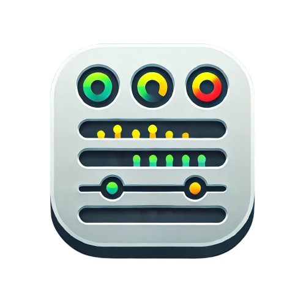
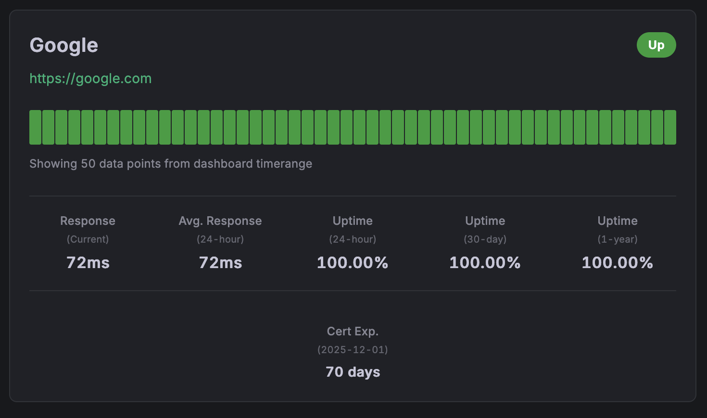

# Minimal Status Panel

<div align="center">
  
</div>

<br>

A beautiful Grafana panel plugin that displays service status information with a clean, modern design. Perfect for monitoring your services with an intuitive interface.

[](https://github.com/Perseus985/Minimal-Status-Panel/actions/workflows/ci.yml)
[](https://github.com/Perseus985/Minimal-Status-Panel/actions/workflows/release.yml)
[](LICENSE)
[](https://github.com/Perseus985/Minimal-Status-Panel/releases/latest)
[](https://github.com/Perseus985/Minimal-Status-Panel/releases)

## ✨ Features

- **🎨 Clean Design**: Modern, intuitive interface for status monitoring
- **📊 Two Display Modes**: 
  - **Minimal**: Service name, status, and heartbeat bar only
  - **Full**: Complete view with response times, uptime stats, and certificate info
- **💫 Interactive Heartbeat Bars**: Hover to see timestamps for each status check
- **🔍 Instance Filtering**: Filter services using Prometheus query labels
- **📈 Real-time Data**: Works with Blackbox Exporter and other Prometheus metrics
- **🌙 Theme Support**: Automatically adapts to Grafana's light/dark themes

### 📸 **Display Modes**

#### **Minimal View**
Clean, compact display showing just the essentials:

<div align="center">
  
</div>

#### **Full View**
Complete monitoring dashboard with detailed statistics:

<div align="center">
  
</div>

## 🚀 Quick Start

### Prerequisites

- Grafana 9.0.0 or later
- Prometheus with Blackbox Exporter (recommended)

### Installation

#### Option 1: Download Pre-built Release (Recommended)

1. **Download the latest release** from the [Releases page](https://github.com/Perseus985/Minimal-Status-Panel/releases/latest)
2. **Extract the ZIP file** to your Grafana plugins directory:
   ```bash
   # Extract to Grafana plugins directory
   unzip minimal-status-panel-*.zip -d /var/lib/grafana/plugins/minimal-status-panel/
   ```
3. **Restart Grafana** and enable the plugin in your configuration

#### Option 2: Build from Source

1. **Clone the repository**:
   ```bash
   git clone https://github.com/Perseus985/Minimal-Status-Panel.git
   cd minimal-status-panel
   ```

2. **Build the plugin**:
   ```bash
   npm install
   npm run build
   ```

3. **Copy to Grafana plugins directory**:
   ```bash
   cp -r dist /var/lib/grafana/plugins/minimal-status-panel
   ```

4. **Restart Grafana** and enable the plugin in your configuration

### Development Setup

For development with Docker (includes Prometheus + Blackbox Exporter):

```bash
npm install
npm run build
docker-compose up -d
```

Access Grafana at http://localhost:3001 (admin/admin)

## 📖 Usage

### Creating a Panel

1. **Add a new panel** to your dashboard
2. **Select "Minimal Status Panel"** as the visualization type
3. **Configure your data source** (Prometheus recommended)
4. **Add your query**, for example:
   ```promql
   probe_success
   ```

### Instance Filtering

Filter specific services using Prometheus labels:

```promql
# Show only GitHub
probe_success{instance="https://github.com"}

# Show multiple services
probe_success{instance=~"https://github.com|https://google.com"}

# Filter by job
probe_success{job="blackbox"}
```

### Panel Options

- **Display Mode**: Choose between List, Grid, or Compact layout
- **Display Level**: 
  - **Minimal**: Service name, status badge, URL, and heartbeat bar
  - **Full**: All above plus response times, uptime statistics, and certificate info
- **Show Labels**: Toggle service name display
- **Show Last Check**: Display last check timestamp
- **Show Response Time**: Display response time metrics
- **Max Items**: Limit number of services shown (1-100)
- **Refresh Interval**: Auto-refresh interval in seconds (5-300)

## 🛠️ Configuration

### Recommended Prometheus Setup

Use with Blackbox Exporter for HTTP/HTTPS monitoring:

```yaml
# prometheus.yml
scrape_configs:
  - job_name: 'blackbox'
    metrics_path: /probe
    params:
      module: [http_2xx]
    static_configs:
      - targets:
        - https://google.com
        - https://github.com
        - https://your-website.com
    relabel_configs:
      - source_labels: [__address__]
        target_label: __param_target
      - source_labels: [__param_target]
        target_label: instance
      - target_label: __address__
        replacement: blackbox-exporter:9115
```

### Supported Metrics

- `probe_success`: Primary metric (1=up, 0=down)
- `probe_duration_seconds`: Response time data
- Any metric with `instance` label for service identification

## 🎨 Examples

### Minimal View
Shows just the essentials - perfect for overview dashboards:
- Service name and status badge
- Clickable URL
- 50-bar heartbeat timeline with hover timestamps

### Full View
Complete monitoring dashboard with:
- All minimal view features
- Current and average response times
- 24-hour, 30-day, and 1-year uptime statistics
- SSL certificate expiration info

### Heartbeat Hover
Hover over any heartbeat bar to see:
- Status (UP/DOWN)
- Exact timestamp
- Visual indication of service health over time

## 🔧 Development

### Build Commands

```bash
# Development build with watch
npm run dev

# Production build
npm run build

# Type checking
npm run typecheck

# Linting
npm run lint
npm run lint:fix

# Testing
npm test
npm run test:ci
```

### Project Structure

```
src/
├── components/
│   ├── StatusPanel.tsx      # Main panel component
│   └── StatusIndicator.tsx  # Individual service card
├── utils/
│   └── dataUtils.ts         # Data parsing utilities
├── types.ts                 # TypeScript interfaces
├── plugin.ts                # Panel options configuration
└── module.ts                # Plugin entry point
```

## 📝 License

This project is licensed under the MIT License - see the [LICENSE](LICENSE) file for details.

## 🤝 Contributing

Contributions are welcome! Please feel free to submit a Pull Request.

1. Fork the repository
2. Create your feature branch (`git checkout -b feature/AmazingFeature`)
3. Commit your changes (`git commit -m 'Add some AmazingFeature'`)
4. Push to the branch (`git push origin feature/AmazingFeature`)
5. Open a Pull Request

## 🐛 Issues

Found a bug or have a feature request? Please [open an issue](https://github.com/Perseus985/Minimal-Status-Panel/issues).

## ⭐ Show Your Support

If this plugin helped you, please consider giving it a ⭐ on GitHub!