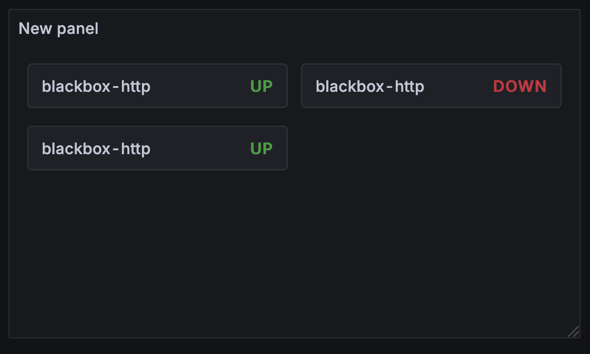
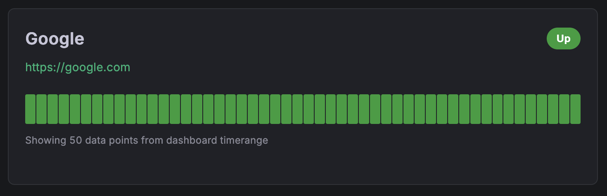
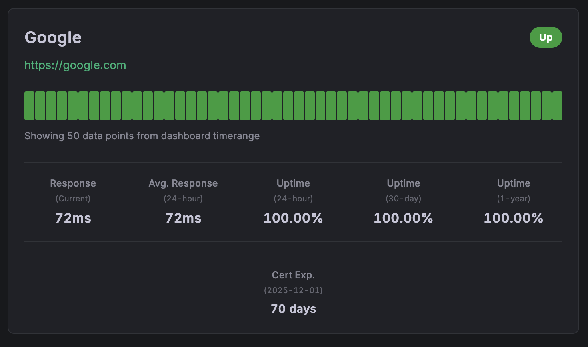

# Display Modes Guide

Explore all the visual options available in the Minimal Status Panel and learn when to use each mode for maximum impact.

## 🎨 Display Mode Overview

The Minimal Status Panel offers **3 display modes** and **3 display levels** for a total of **9 different visual combinations**. Each is optimized for specific use cases and screen sizes.

## 📊 Display Modes

### List Mode
**Best for**: Detailed monitoring, smaller service counts (5-15 services)

Traditional vertical layout that provides maximum information density while maintaining readability.

**Characteristics:**
- ✅ Full information visibility
- ✅ Excellent readability
- ✅ Optimal for detailed analysis
- ❌ Takes more vertical space

**Use cases:**
- Operations dashboards
- Detailed service monitoring
- Status pages with full details
- Team-specific monitoring views

---

### Grid Mode
**Best for**: Overview dashboards, medium service counts (10-30 services)

Responsive card-based layout that adapts to screen size while showing comprehensive information.

**Characteristics:**
- ✅ Responsive design
- ✅ Good information density
- ✅ Visually appealing cards
- ✅ Scales well across devices

**Use cases:**
- Executive dashboards
- Multi-team overview screens
- Service portfolio displays
- Public status pages

---

### Compact Mode
**Best for**: Status walls, large service counts (30+ services), space-constrained displays

Minimal colored dots that provide maximum service density with minimal screen real estate.

**Characteristics:**
- ✅ Maximum density
- ✅ Instant visual status overview
- ✅ Ideal for large screens
- ❌ Limited detailed information

**Use cases:**
- NOC status walls
- Large screen displays
- Quick health overviews
- High-density monitoring

## 🔍 Display Levels

### Ultra-Minimal Level
Shows only the essential information: service name and current status.

**What's included:**
- Service name
- Status text (Up/Down/Warning)
- Status color coding

**Perfect for:**
- Maximum information density
- Quick status overviews
- Mobile displays
- Executive summaries

---

### Minimal Level
Balanced view with essential monitoring information and visual status history.

**What's included:**
- Service name
- Status badge
- Interactive heartbeat bar (50 data points)
- Service URL (if enabled)

**Perfect for:**
- General purpose monitoring
- Team dashboards
- Regular status checks
- Balanced information display

---

### Full Level
Complete monitoring view with detailed statistics and comprehensive information.

**What's included:**
- Everything from Minimal level
- Current response time
- Average response time (24-hour)
- Uptime statistics (24-hour, 30-day, 1-year)
- SSL certificate expiration info
- Last check timestamp

**Perfect for:**
- Operations centers
- Detailed troubleshooting
- Performance monitoring
- SLA tracking

## 🎯 Combination Examples

### 1. List + Ultra-Minimal
<div align="center">
  
</div>

**Configuration:**
```json
{
  "displayMode": "list",
  "displayLevel": "ultra-minimal",
  "showLabels": true,
  "maxItems": 20
}
```

**Best for:**
- Customer status pages
- Mobile dashboards
- Quick health checks
- Executive reporting

---

### 2. List + Minimal
<div align="center">
  
</div>

**Configuration:**
```json
{
  "displayMode": "list",
  "displayLevel": "minimal",
  "showLabels": true,
  "showUrls": true,
  "maxItems": 15
}
```

**Best for:**
- Team monitoring dashboards
- General service oversight
- Balanced information display
- Daily operations

---

### 3. List + Full
<div align="center">
  
</div>

**Configuration:**
```json
{
  "displayMode": "list",
  "displayLevel": "full",
  "showLabels": true,
  "showUrls": true,
  "showLastCheck": true,
  "showResponseTime": true,
  "maxItems": 10
}
```

**Best for:**
- Operations centers
- Detailed performance monitoring
- SLA tracking dashboards
- Troubleshooting interfaces

---

### 4. Grid + Minimal
**Perfect for responsive dashboards**

Visual: Imagine the minimal cards arranged in a responsive grid (2-4 columns depending on screen size)

**Configuration:**
```json
{
  "displayMode": "grid",
  "displayLevel": "minimal",
  "showLabels": true,
  "maxItems": 20
}
```

**Best for:**
- Executive dashboards
- Overview screens
- Public status displays
- Multi-service monitoring

---

### 5. Grid + Full
**Comprehensive information in card format**

Visual: Full information cards arranged in a responsive grid

**Configuration:**
```json
{
  "displayMode": "grid",
  "displayLevel": "full",
  "showLabels": true,
  "showUrls": false,
  "maxItems": 12
}
```

**Best for:**
- Detailed overview dashboards
- Service portfolio displays
- Performance monitoring grids
- Team-specific views

---

### 6. Compact + Any Level
**Maximum density status indicators**

Visual: Small colored status dots arranged horizontally with optional tooltips

**Configuration:**
```json
{
  "displayMode": "compact",
  "displayLevel": "ultra-minimal",
  "showLabels": false,
  "maxItems": 50
}
```

**Best for:**
- Status walls
- Large screen displays
- Quick health indicators
- High-service-count environments

## 🎨 Visual Design Elements

### Status Colors
- **🟢 Green (#28a745)**: Service is Up and healthy
- **🔴 Red (#dc3545)**: Service is Down or failing
- **🟡 Yellow (#ffc107)**: Service has Warnings
- **⚪ Gray (#6c757d)**: Service is in Maintenance
- **⚫ Dark Gray**: Unknown status

### Heartbeat Bar
Interactive 50-point timeline showing service health over time:
- **Full height bars**: Service was up during this period
- **Shorter bars**: Service was down or had issues
- **Hover tooltips**: Show exact timestamp and status
- **Color coding**: Matches status colors

### Typography
- **Service names**: Bold, prominent display
- **Status badges**: High contrast, colored backgrounds
- **Statistics**: Clean, easy-to-read metrics
- **URLs**: Styled as links with hover effects

## 📱 Responsive Behavior

### Grid Mode Breakpoints
- **Large screens (>1200px)**: 4 columns
- **Medium screens (768-1200px)**: 2-3 columns
- **Small screens (<768px)**: 1-2 columns
- **Mobile (<480px)**: 1 column

### List Mode
- Maintains consistent width
- Font sizes adjust for readability
- Heartbeat bars scale proportionally

### Compact Mode
- Dots resize based on available space
- Maintains minimum touch targets (44px) on mobile
- Tooltips adapt to screen edges

## 🎯 Choosing the Right Mode

### Consider Your Audience

**Technical Teams**
- Use **Full level** for detailed metrics
- **List mode** for detailed analysis
- Show all options (URLs, timestamps, response times)

**Executives/Management**
- Use **Minimal level** for key information
- **Grid mode** for visual appeal
- Hide technical details, focus on status

**Public/Customers**
- Use **Ultra-minimal** or **Minimal level**
- **List mode** for clarity
- Use custom names for user-friendly service names

### Consider Your Screen

**Desktop Monitors**
- Any mode works well
- **Full level** recommended for detailed work
- **Grid mode** for overview dashboards

**Laptops**
- **Grid** or **List mode** work best
- **Minimal level** for balanced information
- Consider screen resolution

**Tablets**
- **Grid mode** excellent for touch interfaces
- **Minimal level** for readability
- Larger touch targets

**Mobile Phones**
- **List mode** for readability
- **Ultra-minimal** or **Minimal level**
- Limit items to 5-10 for performance

**Large Displays/TV Screens**
- **Compact mode** for status walls
- **Grid mode** for detailed overviews
- Larger fonts may be needed

### Consider Your Data Volume

**Few Services (1-10)**
- **List + Full**: Show everything
- Take advantage of available space

**Medium Count (10-30)**
- **Grid + Minimal**: Balanced approach
- **List + Minimal**: Focus on essentials

**Many Services (30+)**
- **Compact mode**: Maximum density
- **Grid + Ultra-minimal**: Overview approach
- Consider multiple panels or filtering

## 💡 Pro Tips

1. **Test different modes** with your actual data to see what works best
2. **Use consistent modes** across related dashboards for user familiarity
3. **Consider your refresh rate**: More detailed modes may need longer refresh intervals
4. **Match the mode to the purpose**: Detailed for troubleshooting, overview for monitoring
5. **Think about your users**: What information do they need most?

## 🔧 Customization Tips

### Color Customization
The plugin respects Grafana's theme colors, but you can customize through:
- Dashboard-level theme settings
- Organization-level custom styling
- Grafana's color preferences

### Font Adjustments
- The plugin uses Grafana's standard fonts
- Font sizes scale automatically with display modes
- Consider Grafana's accessibility settings for larger text

### Spacing and Layout
- Grid column counts adjust automatically
- List item spacing is optimized for readability
- Compact mode maintains minimum usability standards

Ready to implement these modes? Head to the [Configuration Guide](configuration.md) for detailed setup instructions!