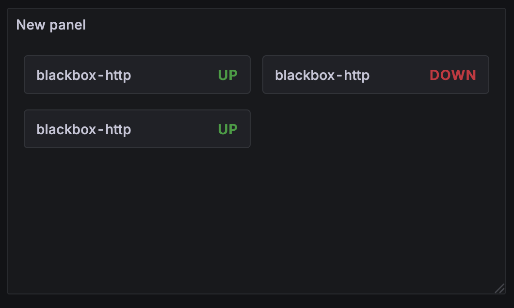

# Minimal Status Panel

<div align="center">
  
</div>

A beautiful **Grafana panel plugin** that displays service status information with a clean, modern design inspired by **Uptime Kuma**. Perfect for monitoring your services with an intuitive interface that provides real-time status updates, heartbeat visualizations, and comprehensive uptime statistics.

[](https://github.com/Perseus985/Minimal-Status-Panel/actions/workflows/ci.yml)
[](https://github.com/Perseus985/Minimal-Status-Panel/actions/workflows/release.yml)
[](https://github.com/Perseus985/Minimal-Status-Panel/blob/main/LICENSE)
[](https://github.com/Perseus985/Minimal-Status-Panel/releases/latest)
[](https://github.com/Perseus985/Minimal-Status-Panel/releases)

## ✨ Key Features

- **🎨 Clean Design**: Modern, intuitive interface for status monitoring
- **📊 Three Display Modes**:
  - **List**: Traditional vertical layout with full information
  - **Grid**: Compact card-based layout for dashboards
  - **Compact**: Ultra-minimal status indicators for space-constrained views
- **🔄 Three Display Levels**:
  - **Ultra-Minimal**: Service name and status only
  - **Minimal**: Service name, status, and heartbeat bar
  - **Full**: Complete view with response times, uptime stats, and certificate info
- **💫 Interactive Heartbeat Bars**: Hover to see timestamps for each status check
- **🔍 Instance Filtering**: Filter services using Prometheus query labels
- **📈 Real-time Data**: Works with Blackbox Exporter and other Prometheus metrics
- **🌙 Theme Support**: Automatically adapts to Grafana's light/dark themes
- **🏷️ Custom Service Names**: Rename services with JSON mapping configuration
- **⚡ Auto-refresh**: Configurable refresh intervals from 5-300 seconds

## 🚀 Quick Start

Ready to get started? Check out our [Getting Started Guide](getting-started.md) for installation instructions and your first panel setup.

## 📸 Display Examples

### Super Minimal View
Ultra-clean display with maximum simplicity:

<div align="center">
  
</div>

### Minimal View
Clean, compact display showing just the essentials:

<div align="center">
  
</div>

### Full View
Complete monitoring dashboard with detailed statistics:

<div align="center">
  
</div>

## 📖 Documentation

- **[Getting Started](getting-started.md)** - Installation and basic setup
- **[Configuration Guide](configuration.md)** - Panel options and customization
- **[Display Modes](display-modes.md)** - Visual examples of all display options
- **[Advanced Usage](advanced-usage.md)** - Service renaming, complex queries, and tips
- **[API Reference](api-reference.md)** - Technical details and data formats
- **[FAQ](faq.md)** - Common questions and troubleshooting

## 🔧 Development

Interested in contributing? Check out our development guide and project structure.

### Quick Development Setup

```bash
git clone https://github.com/Perseus985/Minimal-Status-Panel.git
cd minimal-status-panel
npm install
npm run dev
```

## 🤝 Contributing

We welcome contributions! Please see our [Contributing Guidelines](https://github.com/Perseus985/Minimal-Status-Panel/blob/main/CONTRIBUTING.md) for details on how to submit pull requests, report issues, and suggest improvements.

## 📝 License

This project is licensed under the MIT License - see the [LICENSE](https://github.com/Perseus985/Minimal-Status-Panel/blob/main/LICENSE) file for details.

## ⭐ Support

If this plugin helped you, please consider:
- ⭐ **Starring the repository** on GitHub
- 🐛 **Reporting bugs** via [GitHub Issues](https://github.com/Perseus985/Minimal-Status-Panel/issues)
- 💡 **Suggesting features** to make it even better
- 🔄 **Sharing** with your team and community

---

*Built with ❤️ for the Grafana community*