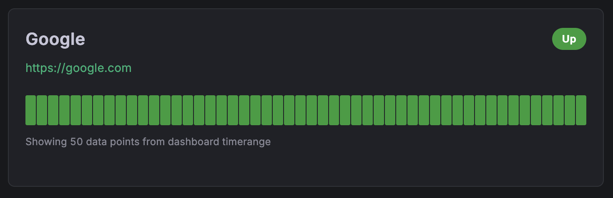

<div class="hero">
  <div class="status-indicators">
    <span class="badge">✨ Clean Design</span>
    <span class="badge">📊 Multiple Views</span>
    <span class="badge">🚀 Easy Setup</span>
    <span class="badge">💫 Interactive</span>
  </div>

  <h1>Minimal Status Panel</h1>
  <p class="hero-subtitle">
    A beautiful Grafana panel plugin that displays service status information with a clean, modern design inspired by Uptime Kuma. Perfect for monitoring your services with an intuitive interface.
  </p>

  <div class="cta-buttons">
    <a href="getting-started" class="btn btn-primary">
      <i class="fas fa-rocket"></i> Get Started
    </a>
    <a href="https://github.com/Perseus985/Minimal-Status-Panel/releases" class="btn btn-secondary">
      <i class="fas fa-download"></i> Download Plugin
    </a>
  </div>
</div>

<div class="feature-grid">
  <div class="feature-card">
    <div class="feature-icon">
      <i class="fas fa-palette"></i>
    </div>
    <h3 class="feature-title">Clean Design</h3>
    <p class="feature-description">
      Modern, intuitive interface inspired by Apple's design principles with automatic light/dark theme support.
    </p>
  </div>

  <div class="feature-card">
    <div class="feature-icon">
      <i class="fas fa-th-large"></i>
    </div>
    <h3 class="feature-title">Multiple Display Modes</h3>
    <p class="feature-description">
      Choose from List, Grid, or Compact layouts with Ultra-minimal, Minimal, or Full information levels.
    </p>
  </div>

  <div class="feature-card">
    <div class="feature-icon">
      <i class="fas fa-heartbeat"></i>
    </div>
    <h3 class="feature-title">Interactive Heartbeat</h3>
    <p class="feature-description">
      Visual heartbeat bars with hover tooltips showing exact timestamps and status history.
    </p>
  </div>

  <div class="feature-card">
    <div class="feature-icon">
      <i class="fas fa-filter"></i>
    </div>
    <h3 class="feature-title">Smart Filtering</h3>
    <p class="feature-description">
      Filter services using Prometheus query labels and customize service names with JSON mapping.
    </p>
  </div>

  <div class="feature-card">
    <div class="feature-icon">
      <i class="fas fa-chart-line"></i>
    </div>
    <h3 class="feature-title">Real-time Metrics</h3>
    <p class="feature-description">
      Works seamlessly with Blackbox Exporter and other Prometheus metrics for live monitoring.
    </p>
  </div>

  <div class="feature-card">
    <div class="feature-icon">
      <i class="fas fa-mobile-alt"></i>
    </div>
    <h3 class="feature-title">Responsive Design</h3>
    <p class="feature-description">
      Optimized for all screen sizes from mobile devices to large status wall displays.
    </p>
  </div>
</div>

<div class="section">
  <div class="section-header">
    <h2 class="section-title">Display Examples</h2>
    <p class="section-subtitle">See how your status panels will look across different display modes</p>
  </div>

  <div class="image-showcase">
    <h3>Super Minimal View</h3>
    <p>Ultra-clean display with maximum simplicity for overview dashboards</p>
    
  </div>

  <div class="image-showcase">
    <h3>Minimal View</h3>
    <p>Clean, compact display showing just the essentials with heartbeat visualization</p>
    
  </div>

  <div class="image-showcase">
    <h3>Full View</h3>
    <p>Complete monitoring dashboard with detailed statistics and performance metrics</p>
    
  </div>
</div>

## 📖 Documentation

- **[Getting Started](getting-started.md)** - Installation and basic setup
- **[Configuration Guide](configuration.md)** - Panel options and customization
- **[Display Modes](display-modes.md)** - Visual examples of all display options
- **[Advanced Usage](advanced-usage.md)** - Service renaming, complex queries, and tips
- **[API Reference](api-reference.md)** - Technical details and data formats
- **[FAQ](faq.md)** - Common questions and troubleshooting

## 🔧 Development

Interested in contributing? Check out our development guide and project structure.

### Quick Development Setup

```bash
git clone https://github.com/Perseus985/Minimal-Status-Panel.git
cd minimal-status-panel
npm install
npm run dev
```

## 🤝 Contributing

We welcome contributions! Please see our [Contributing Guidelines](https://github.com/Perseus985/Minimal-Status-Panel/blob/main/CONTRIBUTING.md) for details on how to submit pull requests, report issues, and suggest improvements.

## 📝 License

This project is licensed under the MIT License - see the [LICENSE](https://github.com/Perseus985/Minimal-Status-Panel/blob/main/LICENSE) file for details.

## ⭐ Support

If this plugin helped you, please consider:
- ⭐ **Starring the repository** on GitHub
- 🐛 **Reporting bugs** via [GitHub Issues](https://github.com/Perseus985/Minimal-Status-Panel/issues)
- 💡 **Suggesting features** to make it even better
- 🔄 **Sharing** with your team and community

---

*Built with ❤️ for the Grafana community*